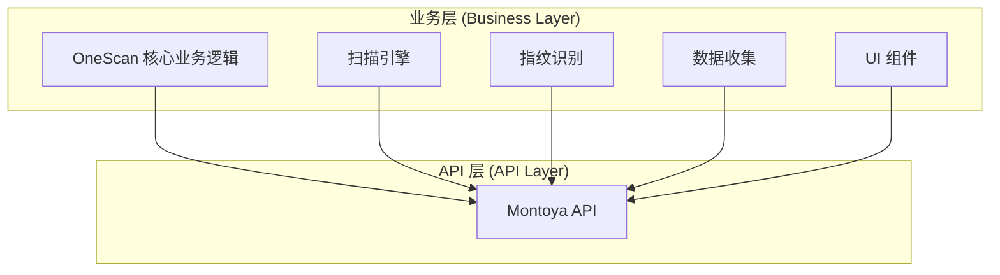

# 设计文档

## 概述

本设计文档描述了 OneScan 插件从传统 Burp Extender API 直接迁移到 Montoya API 的简洁技术方案。设计采用直接替换策略，删除所有传统 API 调用，直接使用 Montoya API，避免过度工程化。

## 核心设计原则

1. **简单直接**: 直接替换 API 调用，不引入适配器层或中间抽象
2. **编译器驱动**: 让编译器找出所有需要修改的地方，确保不遗漏
3. **零拷贝**: 直接使用 Montoya API 类型，消除数据转换开销
4. **快速迁移**: 2周完成整个迁移，专注核心功能

## 架构设计

### 整体架构



**设计说明**:
- 删除适配器层，业务逻辑直接使用 Montoya API
- 消除数据转换和拷贝开销
- 简化代码结构，提高可维护性

## 组件设计

### 插件入口重构

```java
/**
 * OneScan 插件主入口 - 直接使用 Montoya API
 */
public class BurpExtender implements BurpExtension {
    
    private MontoyaApi montoya;
    private ScanEngine scanEngine;
    private FingerprintManager fingerprintManager;
    private CollectManager collectManager;
    
    @Override
    public void initialize(MontoyaApi montoya) {
        this.montoya = montoya;
        
        // 初始化核心组件
        this.scanEngine = new ScanEngine(montoya);
        this.fingerprintManager = new FingerprintManager(montoya);
        this.collectManager = new CollectManager(montoya);
        
        // 注册 UI 组件
        montoya.userInterface().registerSuiteTab("OneScan", createMainPanel());
        
        // 注册上下文菜单
        montoya.userInterface().registerContextMenuItemsProvider(new OneScanContextMenu(montoya));
        
        // 注册代理监听器
        montoya.proxy().registerResponseHandler(new OneScanProxyHandler(scanEngine));
        
        montoya.logging().logToOutput("OneScan v2.3.0 已加载 (使用 Montoya API)");
    }
}
```

### HTTP 请求处理

```java
/**
 * 扫描引擎 - 直接使用 Montoya HTTP API
 */
public class ScanEngine {
    
    private final MontoyaApi montoya;
    
    public ScanEngine(MontoyaApi montoya) {
        this.montoya = montoya;
    }
    
    public ScanResult performScan(String baseUrl, List<String> payloads) {
        List<HttpRequestResponse> responses = new ArrayList<>();
        
        for (String payload : payloads) {
            // 直接构建 Montoya 请求
            HttpRequest request = HttpRequest.httpRequestFromUrl(baseUrl + payload)
                .withAddedHeader("User-Agent", "OneScan/2.3.0");
            
            // 直接发送请求，无需转换
            HttpRequestResponse response = montoya.http().sendRequest(request);
            responses.add(response);
        }
        
        return new ScanResult(responses);
    }
}
```

### UI 组件重构

```java
/**
 * 消息编辑器 - 直接使用 Montoya UI API
 */
public class OneScanMessageEditor {
    
    private final MontoyaApi montoya;
    private MessageEditor requestEditor;
    private MessageEditor responseEditor;
    
    public OneScanMessageEditor(MontoyaApi montoya) {
        this.montoya = montoya;
        
        // 直接创建 Montoya 消息编辑器
        this.requestEditor = montoya.userInterface().createHttpRequestEditor();
        this.responseEditor = montoya.userInterface().createHttpResponseEditor();
    }
    
    public void displayMessage(HttpRequestResponse message) {
        // 直接设置消息，无需转换
        requestEditor.setRequest(message.request());
        responseEditor.setResponse(message.response());
    }
}
```

### 代理监听器重构

```java
/**
 * 代理响应处理器 - 直接使用 Montoya 代理 API
 */
public class OneScanProxyHandler implements ProxyResponseHandler {
    
    private final ScanEngine scanEngine;
    
    public OneScanProxyHandler(ScanEngine scanEngine) {
        this.scanEngine = scanEngine;
    }
    
    @Override
    public ProxyResponseReceivedAction handleResponseReceived(InterceptedResponse interceptedResponse) {
        // 直接处理 Montoya 类型，无需转换
        HttpRequest request = interceptedResponse.initiatingRequest();
        HttpResponse response = interceptedResponse.response();
        
        // 执行指纹识别和数据收集
        scanEngine.analyzeResponse(request, response);
        
        // 继续处理响应
        return ProxyResponseReceivedAction.continueWith(interceptedResponse);
    }
}
```

## 迁移策略

### 阶段 1: 直接替换 API 调用 (1周)
- 修改 BurpExtender 入口类使用 Montoya API
- 替换所有 HTTP 请求调用为 Montoya API
- 更新 UI 组件使用 Montoya 消息编辑器
- 修改代理监听器使用 Montoya 回调机制
- 实现配置文件向后兼容加载

### 阶段 2: 测试和修复 (1-2周)
- 运行单元测试，修复编译和运行错误
- 执行回归测试，对比迁移前后行为一致性
- 手工测试核心功能，修复行为差异
- 专项测试字符编码、错误恢复、线程安全
- 性能测试确保无回退
- 验证配置和数据兼容性

### 数据兼容性保障

#### 关键数据类型分析

| 数据类型 | 存储位置 | v2.2.0 格式 | v2.3.0 要求 | 兼容策略 |
|---------|---------|------------|------------|---------|
| 配置文件 | ~/.onescan/config.yaml | YAML | YAML | 版本检测 + 自动升级 |
| 指纹规则 | ~/.onescan/fingerprints.yaml | YAML | YAML | 完全兼容 |
| 扫描历史 | ~/.onescan/history/ | JSON | JSON | HTTP 消息格式需验证 |
| Payload 字典 | ~/.onescan/payloads/ | TXT | TXT | 完全兼容 |
| 黑白名单 | config.yaml | 嵌入配置 | 嵌入配置 | 完全兼容 |

#### 配置文件版本管理

```java
/**
 * 配置文件版本标记和自动升级
 */
public class Config {

    // 版本标记
    private static final String CURRENT_VERSION = "2.3.0";
    private String version;

    /**
     * 智能加载配置 - 自动处理版本差异
     */
    public static Config load(MontoyaApi montoya) throws IOException {
        Path configPath = getConfigPath();

        if (!Files.exists(configPath)) {
            // 首次使用，创建默认配置
            Config config = createDefault();
            config.version = CURRENT_VERSION;
            config.save();
            return config;
        }

        // 读取 YAML
        Map<String, Object> data = readYaml(configPath);
        String fileVersion = (String) data.get("version");

        // 版本兼容性处理
        if (fileVersion == null || fileVersion.startsWith("2.2.")) {
            montoya.logging().logToOutput("[OneScan] 检测到旧版本配置 (" +
                (fileVersion != null ? fileVersion : "unknown") + ")，自动升级到 " + CURRENT_VERSION);

            // 备份旧配置
            Files.copy(configPath, configPath.resolveSibling("config.yaml.v" +
                (fileVersion != null ? fileVersion : "2.2.0") + ".backup"));

            // 升级配置
            Config config = upgradeFromV2_2(data, montoya);
            config.version = CURRENT_VERSION;
            config.save();
            return config;

        } else if (fileVersion.equals(CURRENT_VERSION)) {
            // 当前版本，直接解析
            return parseConfig(data);

        } else {
            // 未来版本（降级场景）
            montoya.logging().logToError("[OneScan] 配置文件版本 (" + fileVersion +
                ") 高于当前插件版本 (" + CURRENT_VERSION + ")，尝试兼容加载");
            return parseConfigLenient(data, montoya);
        }
    }

    /**
     * 从 v2.2.0 升级配置
     */
    private static Config upgradeFromV2_2(Map<String, Object> oldData, MontoyaApi montoya) {
        // v2.2.0 和 v2.3.0 的配置格式完全相同，只需添加版本标记
        Config config = parseConfig(oldData);

        // 如果未来有格式差异，在这里转换
        // 例如：重命名配置项、调整数据结构等

        return config;
    }

    /**
     * 宽容模式解析 - 用于降级场景
     */
    private static Config parseConfigLenient(Map<String, Object> data, MontoyaApi montoya) {
        try {
            // 尝试正常解析
            return parseConfig(data);
        } catch (Exception e) {
            // 解析失败，使用默认值 + 已知配置项
            montoya.logging().logToError("[OneScan] 配置解析失败，使用默认配置: " + e.getMessage());
            return createDefaultWithKnownValues(data, montoya);
        }
    }
}
```

#### HTTP 消息格式验证

```java
/**
 * 扫描历史兼容性验证
 */
public class ScanHistory {

    /**
     * 加载历史记录 - 兼容旧格式
     */
    public static List<ScanRecord> loadHistory(MontoyaApi montoya) {
        Path historyDir = Paths.get(System.getProperty("user.home"), ".onescan", "history");
        List<ScanRecord> records = new ArrayList<>();

        try {
            Files.list(historyDir)
                .filter(p -> p.toString().endsWith(".json"))
                .forEach(file -> {
                    try {
                        String json = Files.readString(file);
                        ScanRecord record = parseRecord(json, montoya);
                        records.add(record);
                    } catch (Exception e) {
                        // 记录解析失败，但不影响其他记录
                        montoya.logging().logToError("历史记录加载失败: " + file + " - " + e.getMessage());
                    }
                });

        } catch (IOException e) {
            montoya.logging().logToError("历史目录读取失败: " + e.getMessage());
        }

        return records;
    }

    /**
     * 解析扫描记录 - 兼容处理
     */
    private static ScanRecord parseRecord(String json, MontoyaApi montoya) throws IOException {
        Map<String, Object> data = parseJson(json);

        // 检查是否包含旧版本的序列化 HTTP 消息
        if (data.containsKey("httpMessage")) {
            // v2.2.0 可能直接序列化了 IHttpRequestResponse 对象
            // 这种格式不兼容，需要提示用户
            montoya.logging().logToError("检测到不兼容的历史记录格式，跳过");
            throw new IOException("Incompatible history format from v2.2.0");
        }

        // 正常解析（假设使用 URL + 响应码 + 时间戳 等基础字段）
        return ScanRecord.fromMap(data);
    }
}
```

#### 降级回退支持

```java
/**
 * 配置降级保护 - 确保新版本写入的配置不破坏旧版本
 */
public class Config {

    /**
     * 保存配置 - 保持向后兼容
     */
    public void save() throws IOException {
        Map<String, Object> data = new LinkedHashMap<>();

        // 保存版本标记
        data.put("version", this.version);

        // 保存所有配置项（按 v2.2.0 兼容的格式）
        data.put("payload", serializePayloadConfig());
        data.put("request", serializeRequestConfig());
        data.put("host", serializeHostConfig());
        // ... 其他配置项

        // 注意：不添加 v2.2.0 不支持的新配置项到顶层
        // 新功能的配置应放在 "extensions" 字段下
        if (hasExtensionConfig()) {
            data.put("extensions", serializeExtensionConfig());
        }

        // 写入 YAML
        writeYaml(getConfigPath(), data);
    }
}
```

## 错误处理

### 异常处理策略

**核心原则**: 区分可恢复错误和致命错误，在具体场景直接处理，不统一包装。

```java
/**
 * 扫描引擎中的错误处理 - 可恢复错误
 */
public class ScanEngine {

    private final MontoyaApi montoya;

    public ScanResult performScan(String baseUrl, List<String> payloads) {
        List<HttpRequestResponse> responses = new ArrayList<>();

        for (String payload : payloads) {
            try {
                HttpRequest request = HttpRequest.httpRequestFromUrl(baseUrl + payload)
                    .withAddedHeader("User-Agent", "OneScan/2.3.0");

                // 发送请求
                HttpRequestResponse response = montoya.http().sendRequest(request);
                responses.add(response);

            } catch (java.net.SocketTimeoutException e) {
                // 可恢复错误: 标记超时主机，继续处理
                montoya.logging().logToError("请求超时，跳过: " + baseUrl + payload);
                markTimeoutHost(baseUrl);
                continue;

            } catch (java.io.IOException e) {
                // 可恢复错误: 网络错误，跳过该 URL
                montoya.logging().logToError("网络错误，跳过: " + baseUrl + payload);
                continue;
            }
        }

        return new ScanResult(responses);
    }
}

/**
 * 插件初始化中的错误处理 - 致命错误
 */
public class BurpExtender implements BurpExtension {

    @Override
    public void initialize(MontoyaApi montoya) {
        try {
            // 加载配置文件
            Config config = Config.load(montoya);

        } catch (IOException e) {
            // 致命错误: 配置加载失败，使用默认配置
            montoya.logging().logToError("配置文件加载失败，使用默认配置: " + e.getMessage());
            Config config = Config.createDefault();

            // 提示用户（通过日志）
            montoya.logging().logToOutput("[OneScan] 警告: 配置文件不可用，已使用默认配置");
        }

        // 继续初始化，不崩溃整个插件
        this.scanEngine = new ScanEngine(montoya, config);
    }
}

/**
 * 指纹识别中的错误处理 - 跳过失败规则
 */
public class FingerprintManager {

    public List<Fingerprint> identify(HttpRequest request, HttpResponse response) {
        List<Fingerprint> matches = new ArrayList<>();

        for (FingerprintRule rule : rules) {
            try {
                if (rule.matches(request, response)) {
                    matches.add(rule.getFingerprint());
                }
            } catch (PatternSyntaxException e) {
                // 可恢复错误: 正则规则错误，跳过该规则
                montoya.logging().logToError("指纹规则错误，跳过: " + rule.getName());
                continue;
            }
        }

        return matches;
    }
}
```

### 回滚机制

**多层回滚策略，确保用户空间不被破坏**:

#### 1. 代码回滚
```bash
# 回滚到上一个稳定版本
git revert <commit-hash>

# 重新构建
mvn clean package

# 验证构建成功
java -jar target/OneScan-v2.2.0.jar --version
```

#### 2. 配置回滚
```bash
# 迁移前备份配置文件
cp ~/.onescan/config.yaml ~/.onescan/config.yaml.v2.2.0.backup

# 如果新版本修改了配置格式，回滚时恢复
mv ~/.onescan/config.yaml.v2.2.0.backup ~/.onescan/config.yaml
```

#### 3. 数据兼容性保护
```java
/**
 * 配置加载器 - 支持多版本格式
 */
public class Config {

    private static final String CONFIG_VERSION = "2.3.0";

    public static Config load(MontoyaApi montoya) throws IOException {
        Path configPath = getConfigPath();

        // 读取配置文件
        Map<String, Object> data = readYaml(configPath);

        // 检查版本
        String version = (String) data.get("version");
        if (version == null || version.startsWith("2.2.")) {
            // 旧版本配置，自动升级
            return upgradeFromV2_2(data, montoya);
        }

        // 新版本配置
        return parseConfig(data);
    }

    private static Config upgradeFromV2_2(Map<String, Object> oldData, MontoyaApi montoya) {
        montoya.logging().logToOutput("[OneScan] 检测到 v2.2.0 配置，自动升级中...");

        // 执行格式转换（如果需要）
        Config config = parseConfig(oldData);

        // 保存新格式（备份旧文件）
        backupAndSave(config);

        return config;
    }
}
```

#### 4. 用户通知机制
```markdown
# CHANGELOG.md

## [2.3.0] - 2025-XX-XX

### 重大变更
- **API 迁移**: 从传统 Burp Extender API 迁移到 Montoya API
- **向后兼容**: 完全兼容 v2.2.0 的配置文件和指纹规则

### 升级指南
1. 备份现有配置: `cp ~/.onescan/config.yaml config.yaml.backup`
2. 卸载旧版本插件
3. 安装新版本插件
4. 首次启动时会自动升级配置格式

### 回滚方案
如果遇到问题，可以回滚到 v2.2.0:
1. 下载 v2.2.0: https://github.com/.../releases/tag/v2.2.0
2. 恢复配置: `mv config.yaml.backup ~/.onescan/config.yaml`
3. 重启 Burp Suite
```

## 测试策略

### 核心功能测试

**目标**: 验证业务逻辑正确性，确保行为等价性

```java
/**
 * 扫描引擎业务逻辑测试
 */
@Test
public void testScanEngineBasicFunctionality() {
    // 准备测试数据
    String baseUrl = "http://testsite.com/";
    List<String> payloads = Arrays.asList("admin", "test", "backup");

    // 执行扫描
    ScanResult result = scanEngine.performScan(baseUrl, payloads);

    // 验证业务逻辑
    assertEquals(3, result.getRequestCount());
    assertTrue(result.hasResponses());
}

/**
 * 字符编码测试 - 中文字符处理
 */
@Test
public void testChineseCharacterHandling() {
    // 测试中文 URL
    String url = "http://testsite.com/管理员/";
    HttpRequest request = HttpRequest.httpRequestFromUrl(url);
    assertNotNull(request);

    // 测试中文 Header
    request = request.withAddedHeader("X-Custom", "测试");
    assertTrue(request.hasHeader("X-Custom"));

    // 测试中文 Body
    String body = "{\"name\": \"测试用户\"}";
    request = request.withBody(body);
    assertEquals(body, request.bodyToString());
}

/**
 * 错误恢复行为测试
 */
@Test
public void testErrorRecoveryBehavior() {
    // 模拟超时场景
    String timeoutUrl = "http://timeout-host.com/";

    // 执行扫描
    ScanResult result = scanEngine.performScan(timeoutUrl, payloads);

    // 验证超时主机被标记
    assertTrue(scanEngine.isTimeoutHost("timeout-host.com"));

    // 验证其他 URL 继续处理
    assertTrue(result.hasPartialResults());
}
```

### 集成测试

**目标**: 验证 Montoya API 集成的正确性

```java
/**
 * Montoya API 集成测试
 */
@Test
public void testMontoyaHttpIntegration() {
    // 构建 Montoya 请求
    HttpRequest request = HttpRequest.httpRequestFromUrl("http://example.com/")
        .withMethod("GET")
        .withAddedHeader("User-Agent", "OneScan/2.3.0");

    // 发送请求
    HttpRequestResponse response = montoya.http().sendRequest(request);

    // 验证响应
    assertNotNull(response);
    assertNotNull(response.request());
    assertNotNull(response.response());
}

/**
 * UI 组件集成测试
 */
@Test
public void testMessageEditorIntegration() {
    // 创建 Montoya 消息编辑器
    MessageEditor editor = montoya.userInterface().createHttpRequestEditor();

    // 设置请求
    HttpRequest request = HttpRequest.httpRequestFromUrl("http://example.com/");
    editor.setRequest(request);

    // 验证编辑器状态
    assertNotNull(editor.getRequest());
}
```

### 回归测试

**目标**: 对比迁移前后的行为一致性

```bash
#!/bin/bash
# regression_test.sh - 回归测试脚本

echo "=== OneScan 回归测试 ==="

# 1. 准备测试数据
TEST_URL="http://testsite.local/app/"
TEST_PAYLOADS="admin,backup,test,config"

# 2. 使用 v2.2.0（��统 API）执行扫描
echo "运行 v2.2.0 扫描..."
burp --load-extension=OneScan-v2.2.0.jar \
     --scan-url="$TEST_URL" \
     --payloads="$TEST_PAYLOADS" \
     --output=results_v2.2.0.json

# 3. 使用 v2.3.0（Montoya API）执行扫���
echo "运行 v2.3.0 扫描..."
burp --load-extension=OneScan-v2.3.0.jar \
     --scan-url="$TEST_URL" \
     --payloads="$TEST_PAYLOADS" \
     --output=results_v2.3.0.json

# 4. 对比结果
echo "对比扫描结果..."
python3 compare_results.py results_v2.2.0.json results_v2.3.0.json

# 5. 验证通过条件
# - 扫描的 URL 数量一致
# - 发现的指纹类型和数量一致
# - HTTP 状态码分布一致
# - 响应时间差异在 10% 以内
```

### 兼容性测试

**目标**: 验证数据向后兼容性

```java
/**
 * 配置文件兼容性测试
 */
@Test
public void testConfigBackwardCompatibility() {
    // 加载 v2.2.0 配置文件
    Path v220ConfigPath = Paths.get("test-data/config-v2.2.0.yaml");

    // 使用新代码加载
    Config config = Config.load(v220ConfigPath, montoya);

    // 验证关键配置项
    assertNotNull(config);
    assertEquals(100, config.getQps());
    assertEquals(50, config.getDelay());
    assertTrue(config.getPayloads().contains("admin"));
}

/**
 * 指纹规则兼容性测试
 */
@Test
public void testFingerprintRuleCompatibility() {
    // 加载 v2.2.0 指纹规则
    FingerprintManager fpManager = new FingerprintManager(montoya);
    fpManager.loadRules("test-data/fingerprints-v2.2.0.yaml");

    // 准备测试请求和响应
    HttpRequest request = createTestRequest();
    HttpResponse response = createTestResponse();

    // 执行识别
    List<Fingerprint> matches = fpManager.identify(request, response);

    // 验证匹配结果与 v2.2.0 一致
    assertFingerprintsMatch("expected-v2.2.0.json", matches);
}
```

### 性能测试

**目标**: 验证性能不回退

```java
/**
 * 性能基准测试
 */
@Test
public void testPerformanceBenchmark() {
    int testRounds = 1000;
    List<String> payloads = loadPayloads(100); // 100个 payload

    // 预热
    for (int i = 0; i < 10; i++) {
        scanEngine.performScan("http://testsite.com/", payloads);
    }

    // 性能测试
    long startTime = System.nanoTime();
    for (int i = 0; i < testRounds; i++) {
        scanEngine.performScan("http://testsite.com/", payloads);
    }
    long endTime = System.nanoTime();

    // 计算平均响应时间
    long avgTime = (endTime - startTime) / testRounds / 1_000_000; // 毫秒

    // 验证性能目标
    assertTrue("平均响应时间应小于 50ms", avgTime < 50);

    // 记录性能数据供对比
    System.out.println("平均扫描时间: " + avgTime + "ms");
}

/**
 * 内存使用测试
 */
@Test
public void testMemoryUsage() {
    Runtime runtime = Runtime.getRuntime();

    // 记录初始内存
    runtime.gc();
    long beforeMemory = runtime.totalMemory() - runtime.freeMemory();

    // 执行大量扫描任务
    for (int i = 0; i < 10000; i++) {
        scanEngine.performScan("http://testsite.com/path" + i, payloads);
    }

    // 记录结束内存
    runtime.gc();
    long afterMemory = runtime.totalMemory() - runtime.freeMemory();

    // 计算内存增长
    long memoryGrowth = afterMemory - beforeMemory;
    long memoryGrowthMB = memoryGrowth / 1024 / 1024;

    // 验证内存使用合理（不应超过 100MB）
    assertTrue("内存增长应小于 100MB", memoryGrowthMB < 100);

    System.out.println("内存增长: " + memoryGrowthMB + "MB");
}
```

### 测试原则

1. **测试行为而非实现**: 关注业务逻辑结果，不关注内部 API 调用
2. **关注用户场景**: 优先测试用户实际使用的功能路径
3. **充分回归测试**: 对比迁移前后的行为一致性，确保零破坏
4. **性能基准**: 建立性能基线，持续监控性能变化
5. **自动化优先**: 核心测试自动化，减少人工测试成本

## 性能优势

### 直接使用 Montoya API 的优势
1. **零拷贝**: 直接使用 Montoya 类型，无数据转换开销
2. **现代特性**: 利用 Montoya API 的异步支持和线程安全
3. **内存效率**: 消除适配器层的内存开销
4. **原生编码**: 利用 Montoya API 的原生 UTF-8 支持

### 性能目标
- 响应时间提升或至少不回退
- 内存使用减少（消除适配器层开销）
- 利用 Montoya API 的现代性能特性

## 配置兼容性

### 用户配置完全兼容
```yaml
# 现有配置格式保持不变
payload:
  dictionary: ["admin", "test"]
  processing:
    - type: URL
      prefix: "/"

request:
  qps: 100
  delay: 50
  headers:
    - "User-Agent: OneScan"
```

**说明**: 配置是业务逻辑层面的，与底层 API 无关，完全兼容。

## 日志和监控

### 简洁日志策略
```java
/**
 * 使用 Montoya API 的日志功能
 */
public class OneScanLogger {
    
    private final MontoyaApi montoya;
    
    public OneScanLogger(MontoyaApi montoya) {
        this.montoya = montoya;
    }
    
    public void info(String message) {
        montoya.logging().logToOutput("[OneScan] " + message);
    }
    
    public void error(String message, Throwable e) {
        montoya.logging().logToError("[OneScan ERROR] " + message + ": " + e.getMessage());
    }
}
```

## 总结

这个优化后的迁移设计具有以下核心优势：

### 技术优势
1. **极简代码**: 直接替换 API 调用，无复杂抽象层
2. **零拷贝性能**: 直接使用 Montoya 类型，消除数据转换开销
3. **现代化特性**: 利用 Montoya API 的异步支持和线程安全
4. **清晰维护性**: 直接的 API 调用关系，易于理解和维护

### 用户保障
1. **数据兼容性**: 自动升级旧版本配置，支持降级场景
2. **行为等价性**: 充分的回归测试确保功能一致
3. **错误恢复能力**: 保持现有的容错逻辑，不引入破坏性改变
4. **无缝升级**: 用户无需手动修改配置，自动迁移

### 风险控制
1. **多层回滚机制**: 代码、配置、数据三层回滚保护
2. **充分测试覆盖**: 单元、集成、回归、兼容性、性能多维度测试
3. **版本管理**: 配置文件版本标记，支持格式演进
4. **用户通知**: 清晰的 CHANGELOG 和升级指南

### 实施计划
- **阶段 1**: API 直接替换 + 配置兼容 (1周)
- **阶段 2**: 全面测试 + 问题修复 (1-2周)
- **总工期**: 2-3周（比原计划多 1周用于充分测试）

### 关键成功因素

**遵循 "Never break userspace" 原则**:
1. 配置文件自动升级，保留备份
2. 错误处理保持可恢复性，不崩溃任务
3. 充分回归测试，确保行为等价
4. 提供完整的回滚方案

**简单但不简陋**:
1. 拒绝过度工程（适配器层、转换器等）
2. 但不牺牲必要的保障（测试、兼容性、回滚）
3. 代码简洁，但测试充分
4. 快速迁移，但质量优先

这个设计平衡了"快速迁移"和"质量保障"，在保持代码简洁的同时，确保用户空间不被破坏。