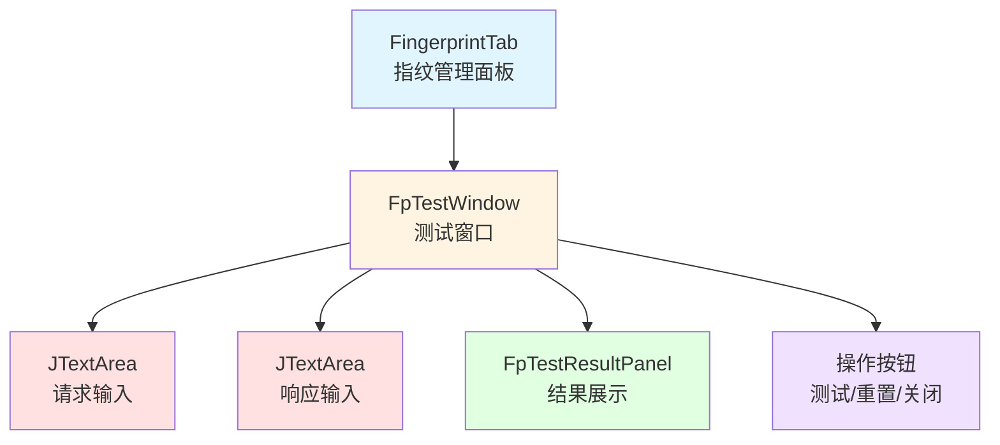
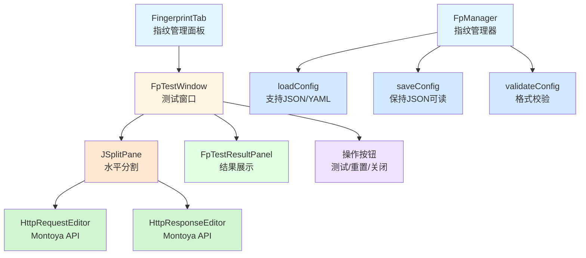
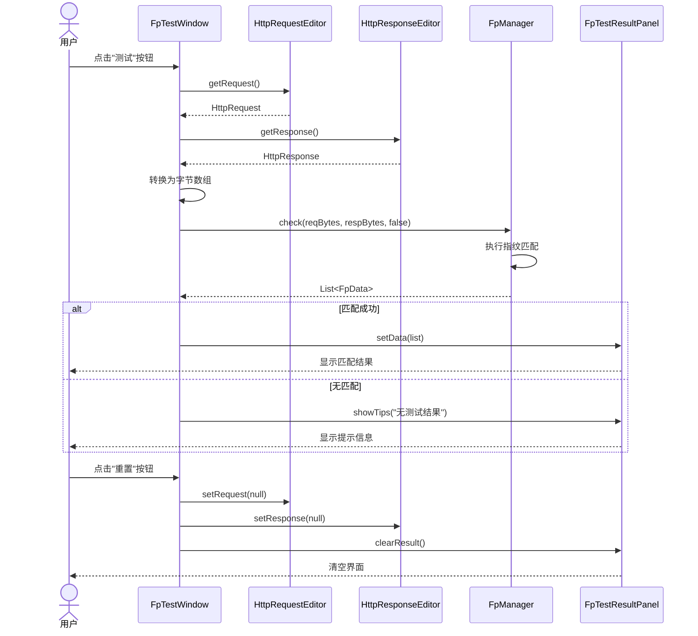
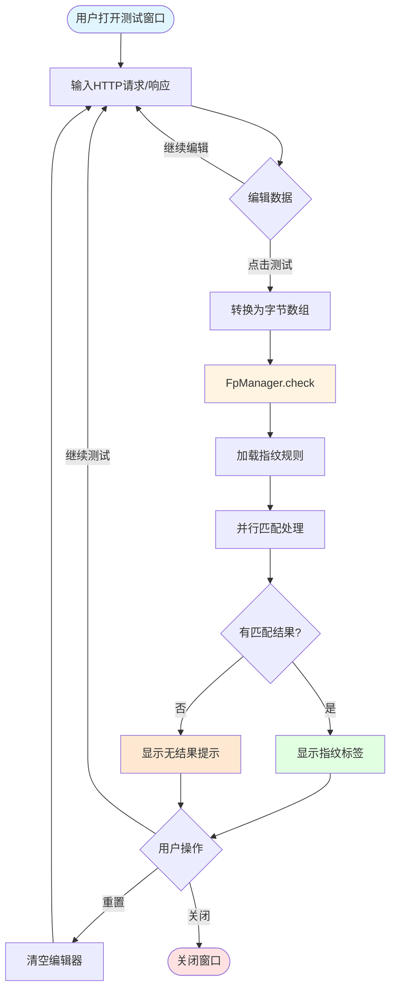

# 指纹测试功能改进 - 设计文档

## 概述

本设计文档描述了OneScan插件指纹测试功能的改进方案。主要改进包括：

1. **指纹配置文件处理优化** - 取消JSON压缩，保留格式校验，提高配置文件的可读性和可维护性
2. **HTTP消息编辑器升级** - 使用Montoya API的标准组件替换现有的JTextArea，提供与Burp Repeater一致的用户体验

这些改进将显著提升用户体验，使指纹规则的测试和调试更加高效。

## 架构

### 当前架构



### 改进后架构



## 测试流程序列图



## 组件和接口

### 1. FpTestWindow 改进

**职责：** 提供指纹测试的用户界面，使用Montoya API组件

**主要变更：**

```java
public class FpTestWindow extends JPanel implements ActionListener {
    // 新增：Montoya API实例
    private final MontoyaApi montoyaApi;
    
    // 替换：使用Montoya API的HTTP编辑器
    private HttpRequestEditor mReqEditor;
    private HttpResponseEditor mRespEditor;
    
    // 新增：分割面板
    private JSplitPane mSplitPane;
    
    // 保留：结果面板和按钮
    private FpTestResultPanel mTestResultPanel;
    private JButton mTestBtn;
    private JButton mResetBtn;
    private JButton mCloseBtn;
    private JFrame mFrame;
    
    // 构造方法需要传入MontoyaApi实例
    public FpTestWindow(MontoyaApi montoyaApi) {
        this.montoyaApi = montoyaApi;
        initView();
        initEvent();
    }
    
    // 可选：支持预填充数据
    public FpTestWindow(MontoyaApi montoyaApi, HttpRequest request, HttpResponse response) {
        this.montoyaApi = montoyaApi;
        initView();
        initEvent();
        setRequestResponse(request, response);
    }
}
```

**关键方法：**

```java
private void initView() {
    setLayout(new VLayout(3));
    setBorder(new EmptyBorder(5, 5, 5, 5));
    
    // 创建HTTP消息编辑器（不需要传入EditorOptions，默认可编辑）
    mReqEditor = montoyaApi.userInterface().createHttpRequestEditor();
    mRespEditor = montoyaApi.userInterface().createHttpResponseEditor();
    
    // 创建水平分割面板
    mSplitPane = new JSplitPane(JSplitPane.HORIZONTAL_SPLIT);
    mSplitPane.setLeftComponent(mReqEditor.uiComponent());
    mSplitPane.setRightComponent(mRespEditor.uiComponent());
    mSplitPane.setDividerLocation(0.5);
    mSplitPane.setResizeWeight(0.5);
    add(mSplitPane, "3w");
    
    // 测试按钮
    mTestBtn = new JButton(L.get("test"));
    mTestBtn.setActionCommand("test");
    add(mTestBtn);
    
    // 测试结果面板
    add(new JLabel(L.get("test_result")));
    mTestResultPanel = new FpTestResultPanel();
    add(mTestResultPanel, "2w");
    
    // 底部按钮
    JPanel bottomPanel = new JPanel(new HLayout(5, true));
    bottomPanel.add(new JPanel(), "1w");
    add(bottomPanel);
    
    mResetBtn = new JButton(L.get("reset"));
    mResetBtn.setActionCommand("reset");
    bottomPanel.add(mResetBtn);
    
    mCloseBtn = new JButton(L.get("close"));
    mCloseBtn.setActionCommand("close");
    bottomPanel.add(mCloseBtn);
}

private void doTest() {
    // 从Montoya编辑器获取HTTP消息
    HttpRequest request = mReqEditor.getRequest();
    HttpResponse response = mRespEditor.getResponse();
    
    // 检查数据是否为空
    if (request == null && response == null) {
        mTestResultPanel.showTips(L.get("input_is_empty"));
        return;
    }
    
    // 转换为字节数组
    byte[] reqBytes = request != null ? request.toByteArray().getBytes() : new byte[0];
    byte[] respBytes = response != null ? response.toByteArray().getBytes() : new byte[0];
    
    // 执行指纹识别（禁用缓存）
    List<FpData> list = FpManager.check(reqBytes, respBytes, false);
    
    if (list.isEmpty()) {
        mTestResultPanel.showTips(L.get("no_test_result_hint"));
        return;
    }
    
    mTestResultPanel.setData(list);
}

private void doReset() {
    // 清空编辑器内容
    mReqEditor.setRequest(null);
    mRespEditor.setResponse(null);
    mTestResultPanel.clearResult();
}

public void setRequestResponse(HttpRequest request, HttpResponse response) {
    if (request != null) {
        mReqEditor.setRequest(request);
    }
    if (response != null) {
        mRespEditor.setResponse(response);
    }
}
```

### 2. FpManager 配置文件处理改进

**职责：** 管理指纹配置文件的加载、保存和校验

**主要变更：**

```java
public class FpManager {
    // 保存配置时保持JSON格式可读性
    public static void saveConfig() {
        checkInit();
        try {
            // 使用Gson的pretty printing
            Gson gson = new GsonBuilder()
                .setPrettyPrinting()
                .disableHtmlEscaping()
                .create();
            
            String json = gson.toJson(sConfig);
            FileUtils.writeStringToFile(sFilePath, json, StandardCharsets.UTF_8);
        } catch (Exception e) {
            throw new IllegalStateException("Failed to save fingerprint config: " + e.getMessage());
        }
    }
    
    // 校验配置文件格式
    private static void validateConfig(FpConfig config) {
        if (config == null) {
            throw new IllegalArgumentException("Fingerprint config is null");
        }
        
        if (config.getColumns() == null || config.getColumns().isEmpty()) {
            throw new IllegalArgumentException("Fingerprint config must have at least one column");
        }
        
        if (config.getList() == null) {
            throw new IllegalArgumentException("Fingerprint config list cannot be null");
        }
        
        // 验证每个指纹数据的完整性
        for (int i = 0; i < config.getListSize(); i++) {
            FpData data = config.getList().get(i);
            if (data.getRules() == null || data.getRules().isEmpty()) {
                Logger.warn("Fingerprint data at index %d has no rules", i);
            }
        }
    }
    
    private static void loadConfig() {
        String content = FileUtils.readFileToString(sFilePath);
        if (StringUtils.isEmpty(content)) {
            throw new IllegalArgumentException("fingerprint config is empty.");
        }

        // 判断文件格式
        if (sFilePath.endsWith(".yaml") || sFilePath.endsWith(".yml")) {
            // YAML 格式解析
            try {
                LoaderOptions options = new LoaderOptions();
                Yaml yaml = new Yaml(new Constructor(FpConfig.class, options));
                sConfig = yaml.load(content);
            } catch (Exception e) {
                throw new IllegalArgumentException("YAML config parsing failed: " + e.getMessage());
            }
        } else if (sFilePath.endsWith(".json")) {
            // JSON 格式解析（向后兼容）
            try {
                sConfig = GsonUtils.toObject(content, FpConfig.class);
            } catch (Exception e) {
                throw new IllegalArgumentException("JSON config parsing failed: " + e.getMessage());
            }
        } else {
            // 自动检测格式：尝试JSON，失败后尝试YAML
            content = content.trim();
            if (content.startsWith("{") || content.startsWith("[")) {
                // 看起来像JSON
                try {
                    sConfig = GsonUtils.toObject(content, FpConfig.class);
                } catch (Exception e) {
                    throw new IllegalArgumentException("JSON config parsing failed: " + e.getMessage());
                }
            } else {
                // 尝试作为YAML解析
                try {
                    LoaderOptions options = new LoaderOptions();
                    Yaml yaml = new Yaml(new Constructor(FpConfig.class, options));
                    sConfig = yaml.load(content);
                } catch (Exception e) {
                    throw new IllegalArgumentException("Config parsing failed (tried both JSON and YAML): " + e.getMessage());
                }
            }
        }

        if (sConfig == null) {
            throw new IllegalArgumentException("fingerprint config parsing failed.");
        }
        
        // 校验配置文件
        validateConfig(sConfig);
    }
}
```

### 3. FingerprintTab 集成改进

**职责：** 管理指纹面板，创建测试窗口时传入MontoyaApi实例

**主要变更：**

```java
public class FingerprintTab extends BaseTab implements ActionListener, KeyListener, OnFpColumnModifyListener {
    
    // 新增：Montoya API实例
    private MontoyaApi mMontoyaApi;
    private FpTestWindow mFpTestWindow;
    
    // 构造方法需要传入MontoyaApi
    public FingerprintTab(MontoyaApi montoyaApi) {
        this.mMontoyaApi = montoyaApi;
    }
    
    /**
     * 指纹测试
     */
    private void doTest() {
        if (mFpTestWindow == null) {
            mFpTestWindow = new FpTestWindow(mMontoyaApi);
        }
        mFpTestWindow.showWindow();
    }
}
```

### 4. BurpExtender 主类集成

**职责：** 初始化插件时传递MontoyaApi实例

**主要变更：**

```java
public class BurpExtender implements IBurpExtender, ... {
    
    private MontoyaApi mMontoyaApi;
    
    @Override
    public void registerExtenderCallbacks(IBurpExtenderCallbacks callbacks) {
        // 获取Montoya API实例
        mMontoyaApi = callbacks.getMontoyaApi();
        
        // 初始化UI组件时传入MontoyaApi
        FingerprintTab fingerprintTab = new FingerprintTab(mMontoyaApi);
        // ...
    }
}
```

## 数据流图



## 数据模型

### FpConfig (指纹配置)

```java
public class FpConfig {
    private List<FpColumn> columns;  // 指纹字段定义
    private List<FpData> list;       // 指纹规则列表
    
    // Getters and setters
}
```

**JSON格式示例（保持可读性）：**

```json
{
  "columns": [
    {
      "id": "yPv",
      "name": "Notes"
    }
  ],
  "list": [
    {
      "params": [
        {
          "k": "yPv",
          "v": "Swagger-UI"
        }
      ],
      "color": "red",
      "rules": [
        [
          {
            "ds": "response",
            "f": "body",
            "m": "iContains",
            "c": "\"swagger\":"
          }
        ]
      ]
    }
  ]
}
```

## 错误处理

### 1. 配置文件解析错误

```java
try {
    FpManager.init(configPath);
} catch (IllegalArgumentException e) {
    Logger.error("Failed to load fingerprint config: %s", e.getMessage());
    UIHelper.showErrorDialog("指纹配置文件加载失败：" + e.getMessage());
}
```

### 2. HTTP消息解析错误

```java
try {
    HttpRequest request = mReqEditor.getRequest();
    // 处理请求
} catch (Exception e) {
    Logger.error("Failed to parse HTTP request: %s", e.getMessage());
    mTestResultPanel.showTips("HTTP请求解析失败：" + e.getMessage());
}
```

### 3. 指纹匹配错误

```java
try {
    List<FpData> results = FpManager.check(reqBytes, respBytes, false);
    // 处理结果
} catch (Exception e) {
    Logger.error("Fingerprint matching failed: %s", e.getMessage());
    mTestResultPanel.showTips("指纹匹配失败：" + e.getMessage());
}
```

## 测试策略

### 1. 单元测试

- **FpManager配置加载测试**
  - 测试JSON格式解析
  - 测试YAML格式解析
  - 测试格式校验
  - 测试错误处理

- **FpManager配置保存测试**
  - 测试JSON格式输出
  - 测试格式可读性
  - 测试特殊字符处理

### 2. 集成测试

- **FpTestWindow UI测试**
  - 测试HTTP编辑器初始化
  - 测试分割面板功能
  - 测试按钮交互

- **指纹匹配测试**
  - 测试从Montoya编辑器获取数据
  - 测试指纹识别流程
  - 测试结果展示

### 3. 用户验收测试

- 测试与Burp Repeater的一致性
- 测试配置文件的可读性和可编辑性
- 测试整体用户体验

## 性能考虑

### 1. HTTP编辑器性能

- Montoya API的编辑器组件已经过优化，支持大型HTTP消息
- 使用懒加载策略，只在需要时解析HTTP消息

### 2. 配置文件性能

- JSON格式化不会显著影响加载性能
- 配置文件通常较小（< 1MB），格式化开销可忽略
- 保存操作不频繁，可接受轻微性能损失

### 3. 指纹匹配性能

- 保持现有的并行流处理机制
- 测试模式禁用缓存，确保结果准确性
- 对于大规模规则集，匹配时间仍在可接受范围内（< 1秒）

## 兼容性

### 1. Burp Suite版本兼容性

- **当前版本**：Burp Suite 2023.12.1（Montoya API v2023.12.1）
- **目标版本**：Burp Suite 2025.5+（Montoya API v2025.5）
- **升级计划**：升级到最新版本以获得最新功能和bug修复
- **最低要求**：Burp Suite 2023.1+（支持Montoya API）
- **说明**：Montoya API v2025.5 是截至2025年10月的最新稳定版本
- **依赖来源**：使用Maven中央仓库依赖（本地API模块已移除）
- 向后兼容：保持对旧版Burp Extender API的支持

### 2. 配置文件兼容性

- 完全向后兼容现有的JSON配置文件
- 支持YAML格式作为替代选项
- 自动检测和解析两种格式

### 3. Java版本兼容性

- 当前：Java 8 (JDK 1.8)
- 未来：计划升级到Java 17

## 部署注意事项

### 1. Montoya API 版本升级

#### 版本信息
- **当前版本**: v2023.12.1
- **目标版本**: v2025.5（截至2025年10月的最新稳定版本）
- **依赖来源**: Maven中央仓库（本地模块已移除）

#### Maven 依赖配置

更新根 `pom.xml` 中的版本属性：

```xml
<properties>
    <montoya-api.version>2025.5</montoya-api.version>
</properties>

<dependencyManagement>
    <dependencies>
        <dependency>
            <groupId>net.portswigger.burp.extensions</groupId>
            <artifactId>montoya-api</artifactId>
            <version>${montoya-api.version}</version>
        </dependency>
    </dependencies>
</dependencyManagement>
```

#### 升级步骤

1. **更新版本号**
   ```bash
   # 编辑 pom.xml
   # 将 <montoya-api.version>2023.12.1</montoya-api.version>
   # 改为 <montoya-api.version>2025.5</montoya-api.version>
   ```

2. **清理并重新构建**
   ```bash
   mvn clean compile
   ```

3. **验证依赖下载**
   - 检查 Maven 是否成功从中央仓库下载 v2025.5
   - 验证编译无错误

4. **测试兼容性**
   - 运行现有测试用例
   - 验证插件功能正常
   - 检查 API 变更影响

#### API 兼容性确认

根据 Montoya API 的设计原则，版本更新通常保持向后兼容。核心 API 方法在 v2025.5 中仍然可用：

✅ **HttpRequestEditor**
- `HttpRequest getRequest()`
- `void setRequest(HttpRequest request)`
- `Component uiComponent()`
- `boolean isModified()`

✅ **HttpResponseEditor**
- `HttpResponse getResponse()`
- `void setResponse(HttpResponse response)`
- `Component uiComponent()`
- `boolean isModified()`

✅ **UserInterface**
- `HttpRequestEditor createHttpRequestEditor(EditorOptions... options)`
- `HttpResponseEditor createHttpResponseEditor(EditorOptions... options)`

#### 参考资源
- [Montoya API GitHub](https://github.com/portswigger/burp-extensions-montoya-api)
- [Montoya API 文档](https://portswigger.github.io/burp-extensions-montoya-api/)
- [Maven Central](https://central.sonatype.com/artifact/net.portswigger.burp.extensions/montoya-api)

### 2. 其他依赖

- 确保 Gson 依赖版本支持 pretty printing（当前 v2.10.1 支持）
- 验证 SnakeYAML 依赖正常（用于 YAML 配置解析）

### 2. 配置迁移

- 现有配置文件无需迁移
- 首次保存时自动格式化为可读格式

### 3. 用户文档

- 更新用户手册，说明新的HTTP编辑器功能
- 提供配置文件格式说明
- 添加常见问题解答

## 未来改进

### 1. 高级编辑器功能

- 支持HTTP消息模板
- 支持从Burp历史记录导入
- 支持批量测试

### 2. 配置文件增强

- 支持配置文件版本控制
- 支持配置文件导入/导出
- 支持在线规则库同步

### 3. 测试结果增强

- 支持导出测试报告
- 支持匹配规则高亮显示
- 支持性能分析
