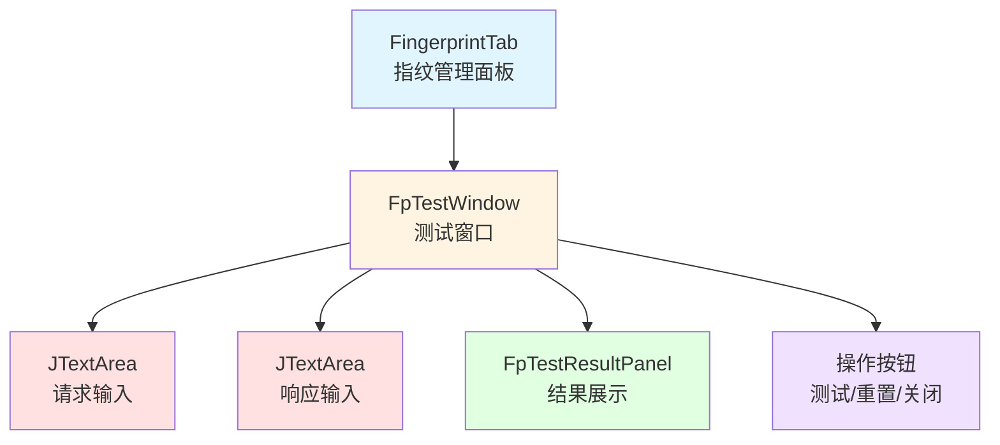
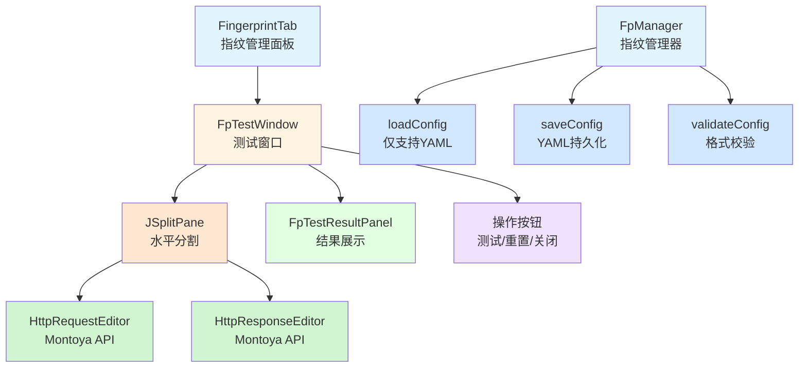
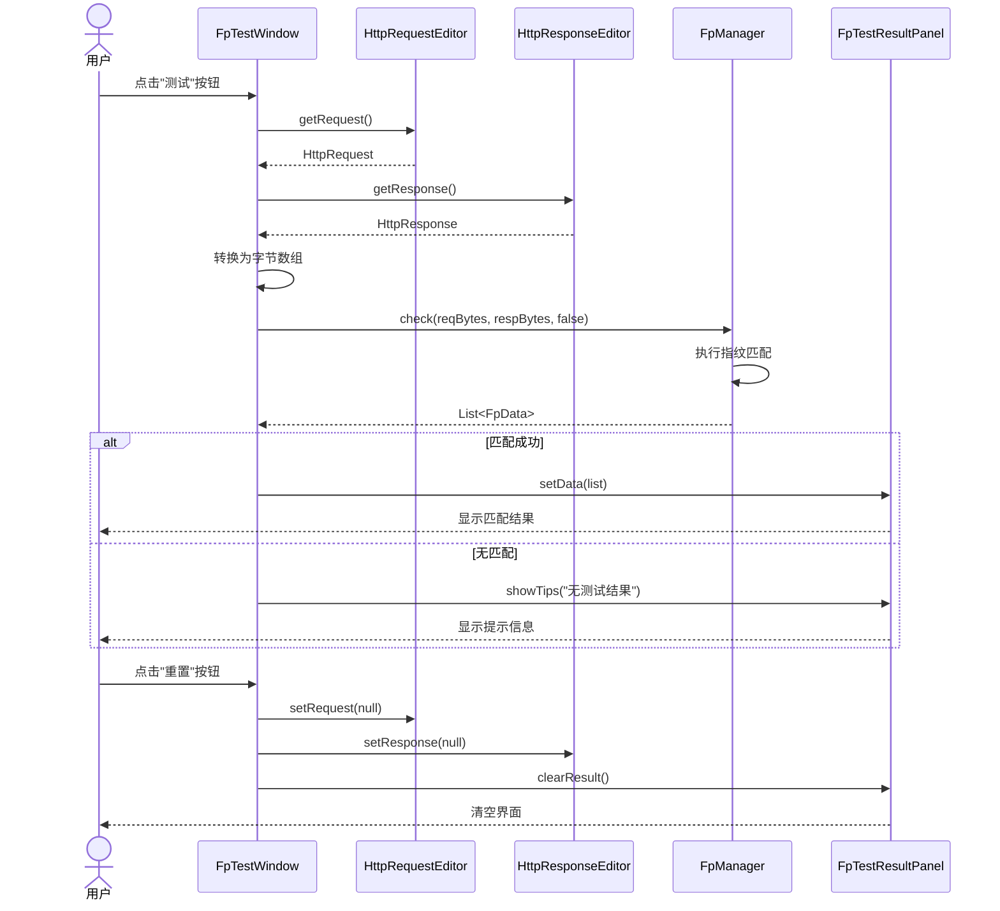
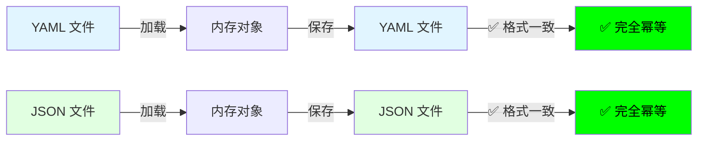

# 指纹测试功能改进 - 设计文档

## 概述

本设计文档描述了OneScan插件指纹测试功能的改进方案。主要改进包括：

1. **指纹配置文件处理优化** - 统一使用YAML格式，添加格式校验，提高配置文件的可读性和可维护性
2. **HTTP消息编辑器升级** - 使用Montoya API的标准组件替换现有的JTextArea，提供与Burp Repeater一致的用户体验

这些改进将显著提升用户体验，使指纹规则的测试和调试更加高效。

## 当前实现状态

### 已实现的功能 ✅

1. **配置文件加载**
   - `FpManager.loadConfig()` - 支持 YAML 格式（.yaml/.yml）
   - 基于文件扩展名的格式判断
   - 基本的错误处理

2. **配置文件保存**
   - `FpConfig.writeToFile()` - 自动保存机制
   - 后台线程异步处理
   - 线程安全（使用同步锁）
   - 数据修改时自动触发保存

3. **数据管理**
   - 字段（columns）的增删改查
   - 指纹数据（list）的增删改查
   - 缓存和历史记录管理

### 需要改进的功能 ⚠️

1. **配置文件格式**
   - ✅ 统一 YAML 保存，采用 BLOCK 风格与 pretty flow
   - 影响：配置文件可读性提升，便于手工编辑

2. **配置校验**
   - ❌ 没有 `validateConfig()` 方法
   - ❌ 不验证必需字段（columns, list）
   - ❌ 不验证数据完整性
   - 影响：可能加载不完整或无效的配置

3. **错误处理**
   - ⚠️ 错误信息较简单
   - ⚠️ 缺少文件路径等上下文信息
   - 影响：调试困难

### 实现优先级

| 优先级 | 功能 | 工作量 | 风险 |
|--------|------|--------|------|
| 🔴 高 | 启用 Pretty Printing | 1-2小时 | 低 |
| 🔴 高 | 添加配置校验 | 2-4小时 | 低 |
| 🟡 中 | 改进错误处理 | 1-2小时 | 低 |

## 架构

### 当前架构



### 改进后架构



## 测试流程序列图



## 组件和接口

### 1. FpTestWindow 改进

**职责：** 提供指纹测试的用户界面，使用Montoya API组件

**主要变更：**

```java
public class FpTestWindow extends JPanel implements ActionListener {
    // 新增：Montoya API实例
    private final MontoyaApi montoyaApi;
    
    // 替换：使用Montoya API的HTTP编辑器
    private HttpRequestEditor mReqEditor;
    private HttpResponseEditor mRespEditor;
    
    // 新增：分割面板
    private JSplitPane mSplitPane;
    
    // 保留：结果面板和按钮
    private FpTestResultPanel mTestResultPanel;
    private JButton mTestBtn;
    private JButton mResetBtn;
    private JButton mCloseBtn;
    private JFrame mFrame;
    
    // 构造方法需要传入MontoyaApi实例
    public FpTestWindow(MontoyaApi montoyaApi) {
        this.montoyaApi = montoyaApi;
        initView();
        initEvent();
    }
    
    // 可选：支持预填充数据
    public FpTestWindow(MontoyaApi montoyaApi, HttpRequest request, HttpResponse response) {
        this.montoyaApi = montoyaApi;
        initView();
        initEvent();
        setRequestResponse(request, response);
    }
}
```

**关键方法：**

```java
private void initView() {
    setLayout(new VLayout(3));
    setBorder(new EmptyBorder(5, 5, 5, 5));
    
    // 创建HTTP消息编辑器（不需要传入EditorOptions，默认可编辑）
    mReqEditor = montoyaApi.userInterface().createHttpRequestEditor();
    mRespEditor = montoyaApi.userInterface().createHttpResponseEditor();
    
    // 创建水平分割面板
    mSplitPane = new JSplitPane(JSplitPane.HORIZONTAL_SPLIT);
    mSplitPane.setLeftComponent(mReqEditor.uiComponent());
    mSplitPane.setRightComponent(mRespEditor.uiComponent());
    mSplitPane.setDividerLocation(0.5);
    mSplitPane.setResizeWeight(0.5);
    add(mSplitPane, "3w");
    
    // 测试按钮
    mTestBtn = new JButton(L.get("test"));
    mTestBtn.setActionCommand("test");
    add(mTestBtn);
    
    // 测试结果面板
    add(new JLabel(L.get("test_result")));
    mTestResultPanel = new FpTestResultPanel();
    add(mTestResultPanel, "2w");
    
    // 底部按钮
    JPanel bottomPanel = new JPanel(new HLayout(5, true));
    bottomPanel.add(new JPanel(), "1w");
    add(bottomPanel);
    
    mResetBtn = new JButton(L.get("reset"));
    mResetBtn.setActionCommand("reset");
    bottomPanel.add(mResetBtn);
    
    mCloseBtn = new JButton(L.get("close"));
    mCloseBtn.setActionCommand("close");
    bottomPanel.add(mCloseBtn);
}

private void doTest() {
    // 从Montoya编辑器获取HTTP消息
    HttpRequest request = mReqEditor.getRequest();
    HttpResponse response = mRespEditor.getResponse();
    
    // 检查数据是否为空
    if (request == null && response == null) {
        mTestResultPanel.showTips(L.get("input_is_empty"));
        return;
    }
    
    // 转换为字节数组
    byte[] reqBytes = request != null ? request.toByteArray().getBytes() : new byte[0];
    byte[] respBytes = response != null ? response.toByteArray().getBytes() : new byte[0];
    
    // 执行指纹识别（禁用缓存）
    List<FpData> list = FpManager.check(reqBytes, respBytes, false);
    
    if (list.isEmpty()) {
        mTestResultPanel.showTips(L.get("no_test_result_hint"));
        return;
    }
    
    mTestResultPanel.setData(list);
}

private void doReset() {
    // 清空编辑器内容
    mReqEditor.setRequest(null);
    mRespEditor.setResponse(null);
    mTestResultPanel.clearResult();
}

public void setRequestResponse(HttpRequest request, HttpResponse response) {
    if (request != null) {
        mReqEditor.setRequest(request);
    }
    if (response != null) {
        mRespEditor.setResponse(response);
    }
}
```

### 2. FpManager 配置文件处理改进

**职责：** 管理指纹配置文件的加载、保存和校验

**当前实现状态：**
- ✅ `loadConfig()` 已实现 - 支持 JSON/YAML，有自动格式检测
- ✅ 保存功能已实现 - 在 `FpConfig.writeToFile()` 中
- ❌ `validateConfig()` 未实现 - 需要添加
- ❌ Pretty printing 未启用 - 需要修改 `FpConfig.writeToFile()`

**主要变更：**

#### 2.1 添加配置校验方法（新增）

```java
// FpManager.java
/**
 * 校验配置文件格式
 * 
 * @param config 配置实例
 * @throws IllegalArgumentException 如果配置无效
 */
private static void validateConfig(FpConfig config) {
    if (config == null) {
        throw new IllegalArgumentException("Fingerprint config is null");
    }
    
    if (config.getColumns() == null || config.getColumns().isEmpty()) {
        throw new IllegalArgumentException(
            "Fingerprint config must have at least one column"
        );
    }
    
    if (config.getList() == null) {
        throw new IllegalArgumentException(
            "Fingerprint config list cannot be null"
        );
    }
    
    // 验证每个指纹数据的完整性
    for (int i = 0; i < config.getListSize(); i++) {
        FpData data = config.getList().get(i);
        if (data.getRules() == null || data.getRules().isEmpty()) {
            Logger.warn("Fingerprint data at index %d has no rules", i);
        }
    }
}
```

#### 2.2 改进 loadConfig() 方法（已存在，需要增强）

```java
// FpManager.java
private static void loadConfig() {
    String content = FileUtils.readFileToString(sFilePath);
    if (StringUtils.isEmpty(content)) {
        throw new IllegalArgumentException(
            "Fingerprint config file is empty: " + sFilePath
        );
    }

    try {
        // 判断文件格式
        if (sFilePath.endsWith(".yaml") || sFilePath.endsWith(".yml")) {
            // YAML 格式解析
            LoaderOptions options = new LoaderOptions();
            Yaml yaml = new Yaml(new Constructor(FpConfig.class, options));
            sConfig = yaml.load(content);
        } else {
            // 非显式 YAML 路径：不进行格式自动检测
            throw new IllegalArgumentException(
                "Unsupported fingerprint config format: " + sFilePath +
                ". Only .yaml/.yml supported."
            );
        }
    } catch (Exception e) {
        throw new IllegalArgumentException(
            "Failed to parse fingerprint config from: " + sFilePath + 
            ". Error: " + e.getMessage(), e
        );
    }

    if (sConfig == null) {
        throw new IllegalArgumentException(
            "Fingerprint config parsing returned null for: " + sFilePath
        );
    }
    
    // 添加配置校验
    validateConfig(sConfig);
}
```

#### 2.3 改进 FpConfig.writeToFile() 方法（已存在，需要修改）

**当前实现**：
```java
// FpConfig.java - 当前代码
private void writeToFile() {
    new Thread(() -> {
        synchronized (FpConfig.class) {
            String json = GsonUtils.toJson(this);  // 历史实现示例：压缩格式，总是 JSON
            FileUtils.writeFile(FpManager.getPath(), json);
        }
    }).start();
}
```

**问题**：
1. ❌ 总是保存为 JSON，即使原文件是 YAML
2. ❌ JSON 格式被压缩，难以阅读
3. ❌ YAML 文件会被转换为 JSON（但文件名还是 .yaml）
4. ❌ 不幂等：YAML → JSON 单向转换

**改进后（统一 YAML）**：
```java
// FpConfig.java - 改进后的代码
private void writeToFile() {
    new Thread(() -> {
        synchronized (FpConfig.class) {
            String filePath = FpManager.getPath();
            String content;
            
            // 统一保存为 YAML 格式
            DumperOptions options = new DumperOptions();
            options.setDefaultFlowStyle(DumperOptions.FlowStyle.BLOCK);
            options.setPrettyFlow(true);
            options.setIndent(2);
            Yaml yaml = new Yaml(options);
            String content = yaml.dump(this);
            FileUtils.writeFile(filePath, content);
        }
    }).start();
}
```

**改进说明**：
- ✅ 统一 YAML 保存（完全幂等）
- ✅ 提升可读性（BLOCK + pretty flow）

**YAML 配置说明**：
- `FlowStyle.BLOCK` - 使用块状风格（多行格式）
- `setPrettyFlow(true)` - 启用美化输出
- `setIndent(2)` - 使用 2 空格缩进

**依赖**：
- SnakeYAML 已存在（用于加载）
- 需要使用 `org.yaml.snakeyaml.DumperOptions` 配置输出
- 需要导入 `org.yaml.snakeyaml.Yaml`

（移除 JSON 相关依赖示例）

**格式示例**：

YAML 输出：
```yaml
columns:
  - id: yPv
    name: Notes
list:
  - params:
      - k: yPv
        v: Swagger-UI
    color: red
    rules:
      - - ds: response
          f: body
          m: iContains
          c: '"swagger":'
```

（JSON 输出示例已移除）
  ],
  "list": [
    {
      "params": [
        {
          "k": "yPv",
          "v": "Swagger-UI"
        }
      ],
      "color": "red",
      "rules": [
        [
          {
            "ds": "response",
            "f": "body",
            "m": "iContains",
            "c": "\"swagger\":"
          }
        ]
      ]
    }
  ]
}
```

### 3. FingerprintTab 集成改进

**职责：** 管理指纹面板，创建测试窗口时传入MontoyaApi实例

**主要变更：**

```java
public class FingerprintTab extends BaseTab implements ActionListener, KeyListener, OnFpColumnModifyListener {
    
    // 新增：Montoya API实例
    private MontoyaApi mMontoyaApi;
    private FpTestWindow mFpTestWindow;
    
    // 构造方法需要传入MontoyaApi
    public FingerprintTab(MontoyaApi montoyaApi) {
        this.mMontoyaApi = montoyaApi;
    }
    
    /**
     * 指纹测试
     */
    private void doTest() {
        if (mFpTestWindow == null) {
            mFpTestWindow = new FpTestWindow(mMontoyaApi);
        }
        mFpTestWindow.showWindow();
    }
}
```

### 4. BurpExtender 主类集成

**职责：** 初始化插件时传递MontoyaApi实例

**主要变更：**

```java
public class BurpExtender implements IBurpExtender, ... {
    
    private MontoyaApi mMontoyaApi;
    
    @Override
    public void registerExtenderCallbacks(IBurpExtenderCallbacks callbacks) {
        // 获取Montoya API实例
        mMontoyaApi = callbacks.getMontoyaApi();
        
        // 初始化UI组件时传入MontoyaApi
        FingerprintTab fingerprintTab = new FingerprintTab(mMontoyaApi);
        // ...
    }
}
```

## 数据流图


## 数据模型

### FpConfig (指纹配置)

```java
public class FpConfig {
    private List<FpColumn> columns;  // 指纹字段定义
    private List<FpData> list;       // 指纹规则列表
    
    // Getters and setters
}
```

**JSON格式示例（保持可读性）：**

```json
{
  "columns": [
    {
      "id": "yPv",
      "name": "Notes"
    }
  ],
  "list": [
    {
      "params": [
        {
          "k": "yPv",
          "v": "Swagger-UI"
        }
      ],
      "color": "red",
      "rules": [
        [
          {
            "ds": "response",
            "f": "body",
            "m": "iContains",
            "c": "\"swagger\":"
          }
        ]
      ]
    }
  ]
}
```

## 错误处理

### 1. 配置文件解析错误

```java
try {
    FpManager.init(configPath);
} catch (IllegalArgumentException e) {
    Logger.error("Failed to load fingerprint config: %s", e.getMessage());
    UIHelper.showErrorDialog("指纹配置文件加载失败：" + e.getMessage());
}
```

### 2. HTTP消息解析错误

```java
try {
    HttpRequest request = mReqEditor.getRequest();
    // 处理请求
} catch (Exception e) {
    Logger.error("Failed to parse HTTP request: %s", e.getMessage());
    mTestResultPanel.showTips("HTTP请求解析失败：" + e.getMessage());
}
```

### 3. 指纹匹配错误

```java
try {
    List<FpData> results = FpManager.check(reqBytes, respBytes, false);
    // 处理结果
} catch (Exception e) {
    Logger.error("Fingerprint matching failed: %s", e.getMessage());
    mTestResultPanel.showTips("指纹匹配失败：" + e.getMessage());
}
```

## 格式幂等性保证

### 幂等性定义

**幂等性**：加载配置 → 修改数据 → 保存配置 → 再加载，数据和格式都保持一致。

### 当前问题（改进前）


**问题**：
- ❌ YAML → JSON 单向转换
- ❌ 文件扩展名与内容不匹配
- ❌ 失去 YAML 的优势（注释、多行字符串等）

### 改进后（方案 A）



**优势**：
- ✅ 完全幂等（格式和数据都保持一致）
- ✅ 尊重用户的格式选择
- ✅ 文件扩展名与内容始终匹配
- ✅ 保留 YAML 的优势

### 幂等性测试矩阵

| 原始格式 | 保存后格式 | 数据幂等 | 格式幂等 | 扩展名匹配 | 总体评估 |
|---------|-----------|---------|---------|-----------|---------|
| JSON (格式化) | JSON (格式化) | ✅ | ✅ | ✅ | ✅ 完全幂等 |
| JSON (压缩) | JSON (格式化) | ✅ | ⚠️ | ✅ | ⚠️ 格式改进 |
| YAML | YAML | ✅ | ✅ | ✅ | ✅ 完全幂等 |

### 详细分析

完整的幂等性分析报告：
- `.agent/idempotency-analysis.md` - 详细分析（含问题、方案、测试）
- `.agent/idempotency-summary.md` - 快速总结

## 测试策略

### 1. 单元测试

- **FpManager配置加载测试**
  - 测试JSON格式解析
  - 测试YAML格式解析
  - 测试格式校验
  - 测试错误处理

- **FpManager配置保存测试**
  - 测试JSON格式输出
  - 测试YAML格式输出
  - 测试格式可读性
  - 测试特殊字符处理

- **格式幂等性测试**
  - 测试JSON文件的幂等性（加载 → 保存 → 再加载）
  - 测试YAML文件的幂等性（加载 → 保存 → 再加载）
  - 测试格式保持（YAML保持YAML，JSON保持JSON）
  - 测试文件扩展名与内容匹配

### 2. 集成测试

- **FpTestWindow UI测试**
  - 测试HTTP编辑器初始化
  - 测试分割面板功能
  - 测试按钮交互

- **指纹匹配测试**
  - 测试从Montoya编辑器获取数据
  - 测试指纹识别流程
  - 测试结果展示

### 3. 用户验收测试

- 测试与Burp Repeater的一致性
- 测试配置文件的可读性和可编辑性
- 测试整体用户体验

## 性能考虑

### 1. HTTP编辑器性能

- Montoya API的编辑器组件已经过优化，支持大型HTTP消息
- 使用懒加载策略，只在需要时解析HTTP消息

### 2. 配置文件性能

- JSON格式化不会显著影响加载性能
- 配置文件通常较小（< 1MB），格式化开销可忽略
- 保存操作不频繁，可接受轻微性能损失

### 3. 指纹匹配性能

- 保持现有的并行流处理机制
- 测试模式禁用缓存，确保结果准确性
- 对于大规模规则集，匹配时间仍在可接受范围内（< 1秒）

## 兼容性

### 1. Burp Suite版本兼容性

- **当前版本**：Burp Suite 2023.12.1（Montoya API v2023.12.1）
- **目标版本**：Burp Suite 2025.5+（Montoya API v2025.5）
- **升级计划**：升级到最新版本以获得最新功能和bug修复
- **最低要求**：Burp Suite 2023.1+（支持Montoya API）
- **说明**：Montoya API v2025.5 是截至2025年10月的最新稳定版本
- **依赖来源**：使用Maven中央仓库依赖（本地API模块已移除）
- 向后兼容：保持对旧版Burp Extender API的支持

### 2. 配置文件兼容性

- 完全向后兼容现有的JSON配置文件
- 支持YAML格式作为替代选项
- 自动检测和解析两种格式

### 3. Java版本兼容性

- 当前：Java 17 (JDK 17)
- 说明：为支持 Montoya API 2025.5，项目已从 Java 8 升级到 Java 17

## 部署注意事项

### 1. Montoya API 版本升级

#### 版本信息
- **当前版本**: v2023.12.1
- **目标版本**: v2025.5（截至2025年10月的最新稳定版本）
- **依赖来源**: Maven中央仓库（本地模块已移除）

#### Maven 依赖配置

更新根 `pom.xml` 中的版本属性：

```xml
<properties>
    <montoya-api.version>2025.5</montoya-api.version>
</properties>

<dependencyManagement>
    <dependencies>
        <dependency>
            <groupId>net.portswigger.burp.extensions</groupId>
            <artifactId>montoya-api</artifactId>
            <version>${montoya-api.version}</version>
        </dependency>
    </dependencies>
</dependencyManagement>
```

#### 升级步骤

1. **更新版本号**
   ```bash
   # 编辑 pom.xml
   # 将 <montoya-api.version>2023.12.1</montoya-api.version>
   # 改为 <montoya-api.version>2025.5</montoya-api.version>
   ```

2. **清理并重新构建**
   ```bash
   mvn clean compile
   ```

3. **验证依赖下载**
   - 检查 Maven 是否成功从中央仓库下载 v2025.5
   - 验证编译无错误

4. **测试兼容性**
   - 运行现有测试用例
   - 验证插件功能正常
   - 检查 API 变更影响

#### API 兼容性确认

根据 Montoya API 的设计原则，版本更新通常保持向后兼容。核心 API 方法在 v2025.5 中仍然可用：

✅ **HttpRequestEditor**
- `HttpRequest getRequest()`
- `void setRequest(HttpRequest request)`
- `Component uiComponent()`
- `boolean isModified()`

✅ **HttpResponseEditor**
- `HttpResponse getResponse()`
- `void setResponse(HttpResponse response)`
- `Component uiComponent()`
- `boolean isModified()`

✅ **UserInterface**
- `HttpRequestEditor createHttpRequestEditor(EditorOptions... options)`
- `HttpResponseEditor createHttpResponseEditor(EditorOptions... options)`

#### 参考资源
- [Montoya API GitHub](https://github.com/portswigger/burp-extensions-montoya-api)
- [Montoya API 文档](https://portswigger.github.io/burp-extensions-montoya-api/)
- [Maven Central](https://central.sonatype.com/artifact/net.portswigger.burp.extensions/montoya-api)

### 2. 其他依赖

- 确保 Gson 依赖版本支持 pretty printing（当前 v2.10.1 支持）
- 验证 SnakeYAML 依赖正常（用于 YAML 配置解析）

### 2. 配置迁移

- 现有配置文件无需迁移
- 首次保存时自动格式化为可读格式

### 3. 用户文档

- 更新用户手册，说明新的HTTP编辑器功能
- 提供配置文件格式说明
- 添加常见问题解答

## 代码分析参考

详细的代码分析报告：
- `.agent/fingerprint-config-analysis.md` - 完整的配置文件处理逻辑分析
- `.agent/config-analysis-summary.md` - 快速总结

### 关键代码位置

| 组件 | 文件路径 | 说明 |
|------|---------|------|
| FpManager | `extender/src/main/java/burp/vaycore/onescan/manager/FpManager.java` | 指纹管理器 |
| FpConfig | `extender/src/main/java/burp/vaycore/onescan/bean/FpConfig.java` | 配置数据模型 |
| FpData | `extender/src/main/java/burp/vaycore/onescan/bean/FpData.java` | 指纹数据模型 |
| FpColumn | `extender/src/main/java/burp/vaycore/onescan/bean/FpColumn.java` | 字段模型 |
| GsonUtils | `extender/src/main/java/burp/vaycore/common/utils/GsonUtils.java` | JSON 工具类 |
| 配置文件 | `src/main/resources/fp_config.yaml` | 指纹配置文件（YAML 格式）|

### 当前实现的关键方法

```java
// FpManager.java
private static void loadConfig()           // 加载配置（已实现）
private static void checkInit()            // 检查初始化（已实现）
public static List<FpData> check(...)      // 指纹识别（已实现）

// FpConfig.java
private void writeToFile()                 // 保存配置（已实现，需改进）
public void addListItem(FpData data)       // 添加数据（已实现）
public void setListItem(int, FpData)       // 更新数据（已实现）

// 需要添加的方法
// FpManager.java
private static void validateConfig(FpConfig)  // 配置校验（待实现）
```

## 未来改进

### 1. 高级编辑器功能

- 支持HTTP消息模板
- 支持从Burp历史记录导入
- 支持批量测试

### 2. 配置文件增强

- 支持配置文件版本控制
- 支持配置文件导入/导出
- 支持在线规则库同步

### 3. 测试结果增强

- 支持导出测试报告
- 支持匹配规则高亮显示
- 支持性能分析
