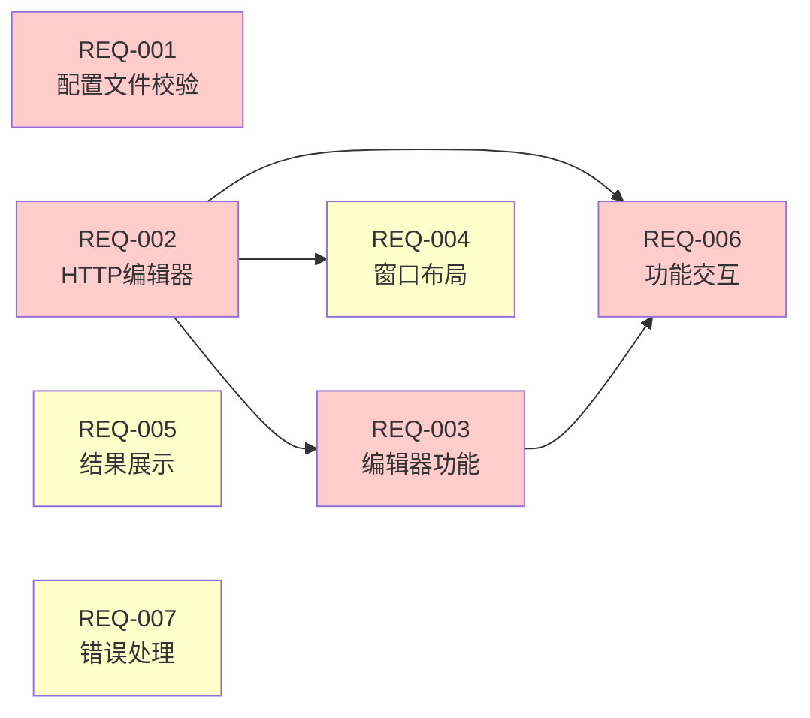

# 指纹测试功能改进 - 需求文档

## 简介

本文档定义OneScan插件指纹测试功能的改进需求。主要改进包括：
1. 优化指纹配置文件的处理方式，取消JSON压缩，保留格式校验
2. 改进指纹测试面板的用户界面，使其与Burp Repeater保持一致的交互体验

## 术语表

- **FpManager**: 指纹管理器，负责指纹规则的加载、匹配和缓存管理
- **FpTestWindow**: 指纹测试窗口，提供用户界面用于输入测试数据
- **FpTestResultPanel**: 指纹测试结果面板，展示匹配到的指纹信息
- **FpData**: 指纹数据实体，包含指纹参数、颜色和匹配规则
- **FpRule**: 指纹规则实体，定义数据源、字段、匹配方法和内容
- **FpMethodHandler**: 指纹匹配方法处理器，提供12种匹配方法
- **HttpRequestEditor**: HTTP请求编辑器组件，由Montoya API提供
- **HttpResponseEditor**: HTTP响应编辑器组件，由Montoya API提供
- **TestSystem**: 指纹测试系统，包含FpTestWindow和相关组件的总称
- **Montoya API**: Burp Suite的现代扩展API，目标版本v2025.5（当前最新稳定版本）

## 需求概览

### 需求优先级

| 需求ID | 需求名称 | 优先级 | 类型 | 依赖 |
|--------|---------|--------|------|------|
| REQ-001 | 指纹配置文件格式校验 | 高 | 功能 | - |
| REQ-002 | Burp风格的HTTP消息编辑器 | 高 | UI | - |
| REQ-003 | HTTP消息编辑器功能 | 高 | 功能 | REQ-002 |
| REQ-004 | 测试窗口布局优化 | 中 | UI | REQ-002 |
| REQ-005 | 测试结果展示 | 中 | UI | - |
| REQ-006 | 测试功能交互 | 高 | 功能 | REQ-002, REQ-003 |
| REQ-007 | 错误处理和用户反馈 | 中 | 功能 | - |

### 需求关系图

**图例**: 🔴 高优先级 | 🟡 中优先级

## 需求详细说明

### REQ-001: 指纹配置文件格式校验

**用户故事:** 作为插件维护者，我希望系统能够校验指纹配置文件的JSON格式正确性，但不压缩文件内容，以便用户可以直接编辑和阅读配置文件

#### 验收标准

1. WHEN 加载指纹配置文件，THE FpManager SHALL 解析JSON或YAML格式的配置文件
2. WHEN JSON格式解析失败，THE FpManager SHALL 抛出IllegalArgumentException异常并提供详细错误信息
3. WHEN 保存指纹配置文件，THE FpManager SHALL 根据文件扩展名选择保存格式
4. WHEN 文件扩展名为.yaml或.yml，THE FpManager SHALL 保存为YAML格式
5. WHEN 文件扩展名为.json或其他，THE FpManager SHALL 保存为格式化的JSON
6. THE FpManager SHALL 保持配置文件的可读性，使用缩进和换行
7. THE FpManager SHALL 验证配置文件包含必需的字段（columns和list）
8. THE FpManager SHALL 保持格式幂等性，加载后保存不改变文件格式

### REQ-002: Burp风格的HTTP消息编辑器

**用户故事:** 作为安全研究人员，我希望指纹测试面板的HTTP消息编辑器与Burp Repeater保持一致的外观和交互方式，以便快速上手使用

#### 验收标准

1. THE FpTestWindow SHALL 使用Montoya API的HttpRequestEditor组件显示HTTP请求
2. THE FpTestWindow SHALL 使用Montoya API的HttpResponseEditor组件显示HTTP响应
3. THE HttpRequestEditor SHALL 支持Raw、Headers、Hex等多种视图模式
4. THE HttpResponseEditor SHALL 支持Raw、Headers、Hex、Render等多种视图模式
5. THE HttpRequestEditor SHALL 提供语法高亮显示HTTP请求内容
6. THE HttpResponseEditor SHALL 提供语法高亮显示HTTP响应内容

### REQ-003: HTTP消息编辑器功能

**用户故事:** 作为安全研究人员，我希望能够像在Burp Repeater中一样编辑和查看HTTP消息，以便方便地测试各种指纹规则

#### 验收标准

1. THE HttpRequestEditor SHALL 允许用户直接编辑HTTP请求的任何部分
2. THE HttpResponseEditor SHALL 允许用户直接编辑HTTP响应的任何部分
3. WHEN 用户切换视图模式，THE HttpRequestEditor SHALL 保持请求数据内容不变
4. WHEN 用户切换视图模式，THE HttpResponseEditor SHALL 保持响应数据内容不变
5. THE HttpRequestEditor SHALL 自动识别和解析HTTP请求行、请求头和请求体
6. THE HttpResponseEditor SHALL 自动识别和解析HTTP状态行、响应头和响应体

### REQ-004: 测试窗口布局优化

**用户故事:** 作为安全研究人员，我希望测试窗口布局合理且易于使用，以便高效地进行指纹测试

#### 验收标准

1. THE FpTestWindow SHALL 使用水平分割面板展示请求和响应编辑器
2. THE FpTestWindow SHALL 允许用户拖动分割条调整请求和响应区域的大小
3. THE FpTestWindow SHALL 在底部展示测试结果面板
4. THE FpTestWindow SHALL 提供"测试"、"重置"、"关闭"三个操作按钮
5. THE FpTestWindow SHALL 设置合理的初始窗口大小（建议1000x700），确保内容可读性

### REQ-005: 测试结果展示

**用户故事:** 作为安全研究人员，我希望测试结果能够清晰展示匹配到的指纹信息，以便快速了解识别效果

#### 验收标准

1. WHEN 指纹匹配成功，THE FpTestResultPanel SHALL 按字段分组展示所有匹配的指纹标签
2. WHEN 多个指纹规则匹配到相同标签，THE FpTestResultPanel SHALL 使用颜色升级算法计算最终颜色
3. WHEN 没有匹配到任何指纹，THE FpTestResultPanel SHALL 显示"无测试结果"提示信息
4. WHEN 输入数据为空，THE FpTestResultPanel SHALL 显示"输入为空"提示信息
5. THE FpTestResultPanel SHALL 使用流式布局展示指纹标签，自动换行适应窗口宽度

### REQ-006: 测试功能交互

**用户故事:** 作为安全研究人员，我希望测试功能交互流畅且符合直觉，以便快速验证指纹规则

#### 验收标准

1. WHEN 用户点击"测试"按钮，THE FpManager SHALL 从编辑器获取HTTP消息字节数组并执行指纹识别
2. WHEN 用户点击"重置"按钮，THE FpTestWindow SHALL 清空请求和响应编辑器内容以及测试结果
3. WHEN 用户点击"关闭"按钮，THE FpTestWindow SHALL 关闭窗口并释放资源
4. THE FpManager SHALL 在测试模式下禁用缓存机制，确保每次测试都重新执行匹配
5. THE FpTestWindow SHALL 在测试完成后保持输入数据，方便用户调整后重新测试

### REQ-007: 错误处理和用户反馈

**用户故事:** 作为安全研究人员，我希望在测试过程中遇到错误时能够获得清晰的反馈，以便快速定位问题

#### 验收标准

1. WHEN 指纹配置文件解析失败，THE FpManager SHALL 抛出IllegalArgumentException异常并提供错误信息
2. WHEN 正则表达式编译失败，THE FpMethodHandler SHALL 记录错误日志并返回false
3. WHEN 测试窗口已打开，THE FpTestWindow SHALL 将现有窗口置于前台
4. WHEN HTTP消息解析失败，THE TestSystem SHALL 在FpTestResultPanel显示错误提示信息
5. WHEN 用户关闭测试窗口，THE FpTestWindow SHALL 释放HttpRequestEditor和HttpResponseEditor资源
